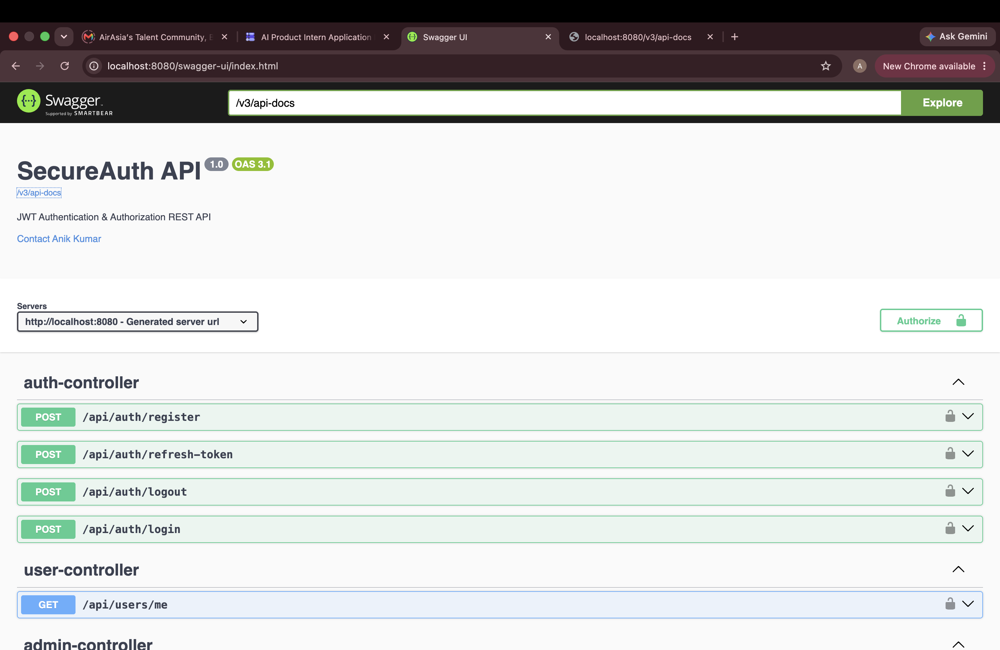
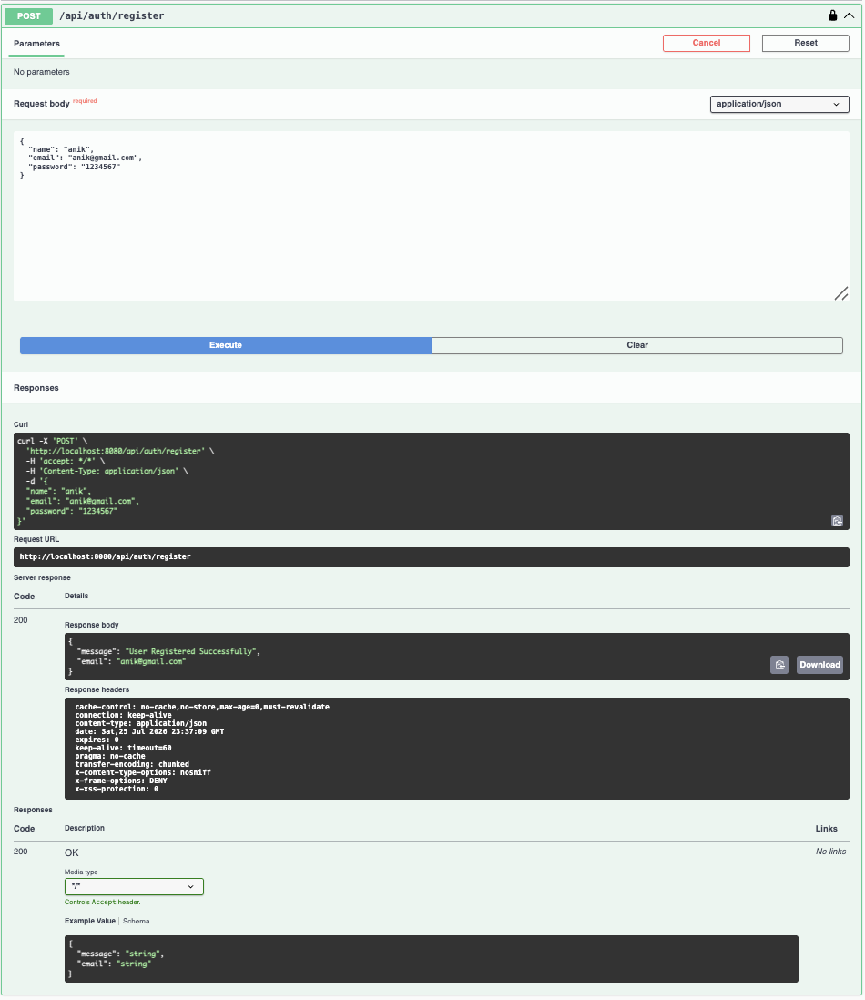
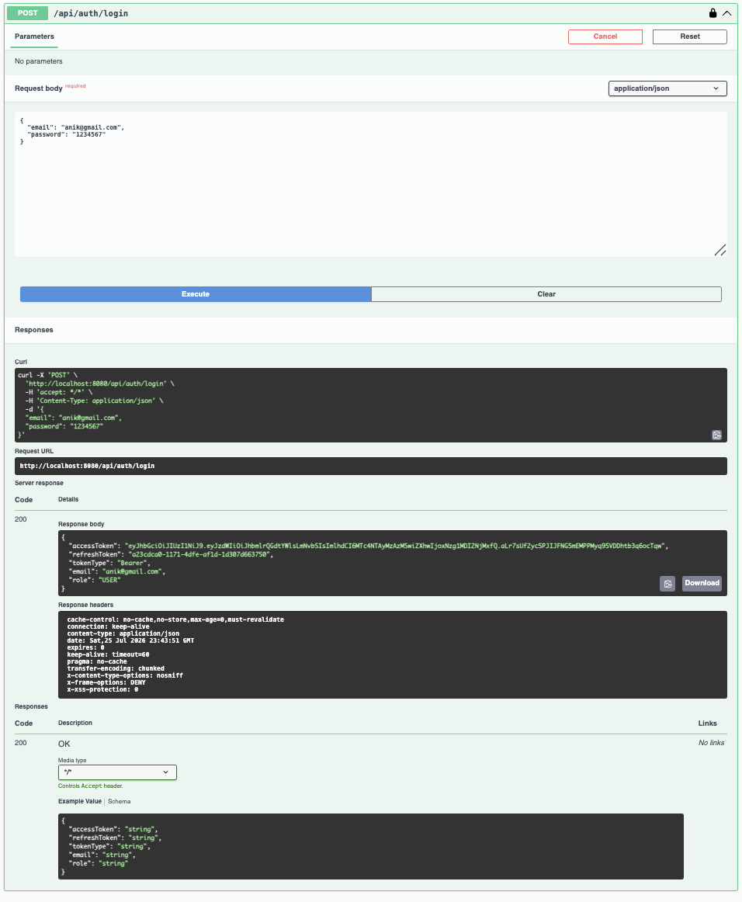
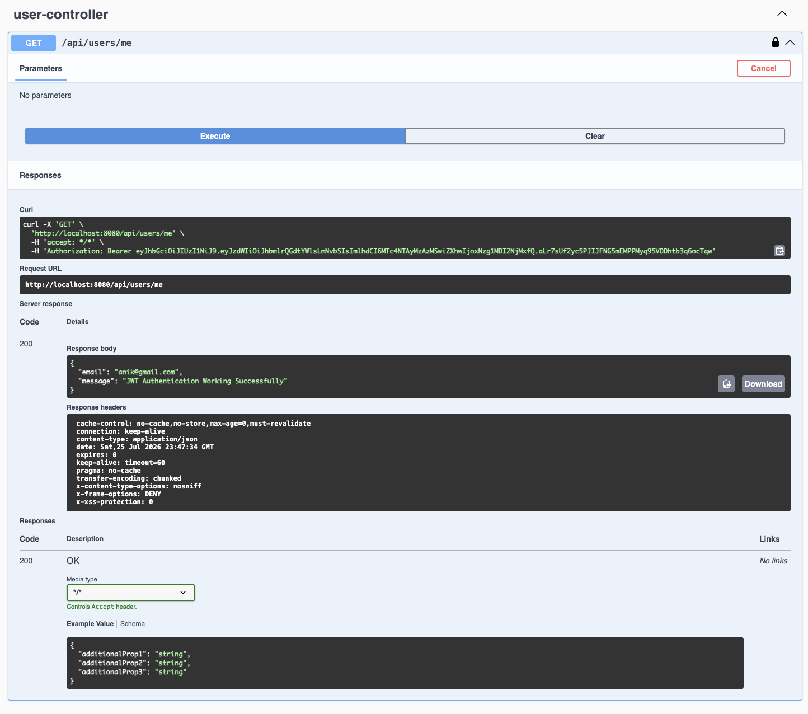
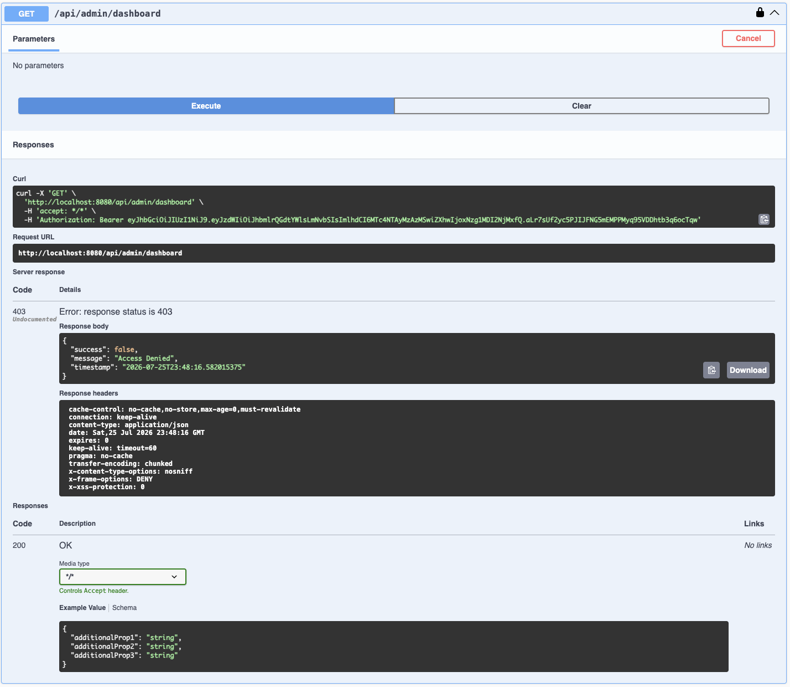
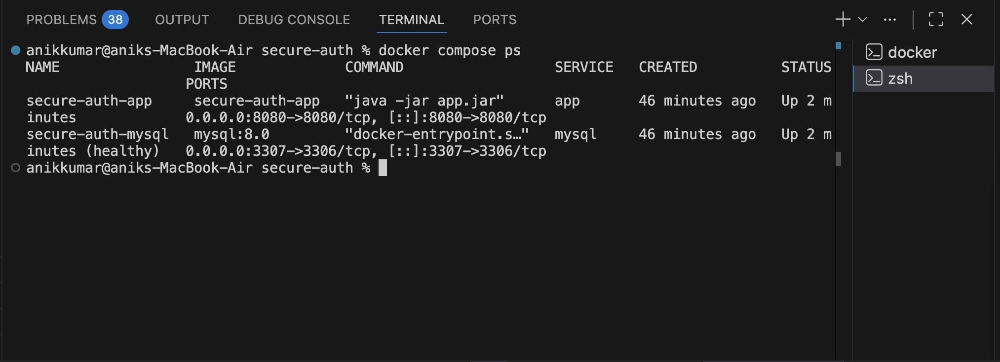
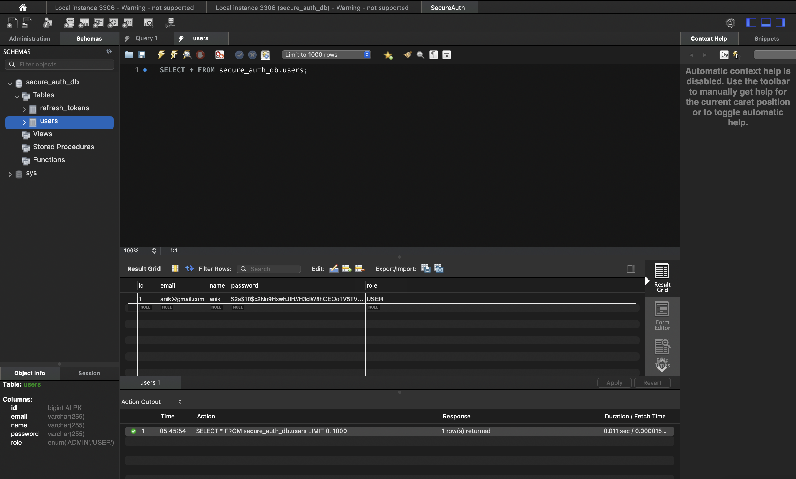
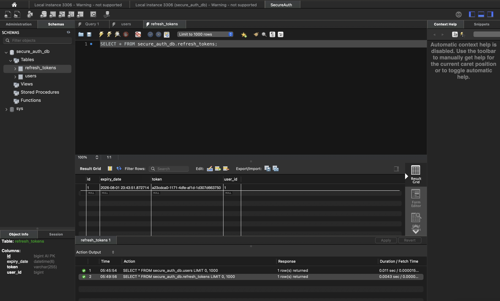

# 🔐 SecureAuth

> A production-ready Authentication & Authorization System built using **Java, Spring Boot, Spring Security, JWT, MySQL, Docker**, and **Swagger UI**.


---

# 📌 Overview

SecureAuth is a secure authentication backend built with Spring Boot that demonstrates industry-standard authentication and authorization practices.

The application provides:

- User Registration
- Secure Login
- JWT Authentication
- Refresh Token Mechanism
- Role-Based Access Control (RBAC)
- Dockerized Deployment
- Swagger API Documentation
- MySQL Database Integration

This project follows clean architecture and REST API best practices.

---

# 🚀 Features

- ✅ User Registration
- ✅ Secure Password Hashing (BCrypt)
- ✅ JWT Access Token Authentication
- ✅ Refresh Token Support
- ✅ Logout with Token Revocation
- ✅ Spring Security 6
- ✅ Role Based Authorization (USER / ADMIN)
- ✅ Global Exception Handling
- ✅ Bean Validation
- ✅ Swagger UI Documentation
- ✅ Docker & Docker Compose
- ✅ MySQL Database
- ✅ RESTful API Design

---

# 🛠 Tech Stack

| Category | Technology |
|----------|------------|
| Language | Java 17 |
| Framework | Spring Boot 3.5 |
| Security | Spring Security 6 |
| Authentication | JWT |
| Database | MySQL 8 |
| ORM | Spring Data JPA (Hibernate) |
| API Docs | Swagger / OpenAPI |
| Build Tool | Maven |
| Containerization | Docker & Docker Compose |

---

# 📂 Project Structure

```text
secure-auth
│
├── src
│   ├── controller
│   ├── service
│   ├── repository
│   ├── security
│   ├── entity
│   ├── dto
│   └── config
│
├── docs
│   └── screenshots
│
├── Dockerfile
├── docker-compose.yml
├── pom.xml
└── README.md
```

---

# 📸 API Screenshots

## 📖 Swagger UI

<p align="center">

</p>

---

## 👤 User Registration

<p align="center">

</p>

---

## 🔐 User Login

<p align="center">

</p>

---

## 🙋 Authenticated User Profile

<p align="center">

</p>

---

## 👑 Admin Endpoint

<p align="center">

</p>

---

# 🐳 Docker Deployment

<p align="center">

</p>

The application is fully containerized using Docker Compose.

Containers:

- secure-auth-app
- secure-auth-mysql

---

# 🗄 Database

<p align="center">

</p>
<p align="center">

</p>

Database tables:

- users
- refresh_tokens

---

# 🔑 Authentication Flow

User Registration

↓

Login

↓

Access Token + Refresh Token

↓

Access Protected APIs

↓

Access Token Expires

↓

Refresh Token Generates New Access Token

↓

Continue Access

↓

Logout → Refresh Token Revoked

---

# 🚀 Getting Started

## Clone Repository

```bash
git clone https://github.com/anik-ug/secure-auth.git
cd secure-auth
```

## Run with Docker

```bash
docker compose up --build
```

Application

```
http://localhost:8080
```

Swagger

```
http://localhost:8080/swagger-ui/index.html
```

---

# 🔒 Security Features

- BCrypt Password Encryption
- JWT Authentication
- Refresh Token Rotation
- Stateless Authentication
- Role-Based Access Control
- Spring Security Filter Chain
- Input Validation
- Global Exception Handling

---

# 📈 Future Improvements

- Email Verification
- Password Reset
- OAuth2 Login (Google/GitHub)
- Redis Token Blacklisting
- CI/CD using GitHub Actions
- Kubernetes Deployment

---

# 👨‍💻 Author

**Anik Kumar**

B.Tech (ECE) • IIIT Ranchi

GitHub: https://github.com/anik-ug

LinkedIn: https://www.linkedin.com/in/anik-kumar-6a8397287/

---

⭐ If you found this project useful, consider giving it a star.